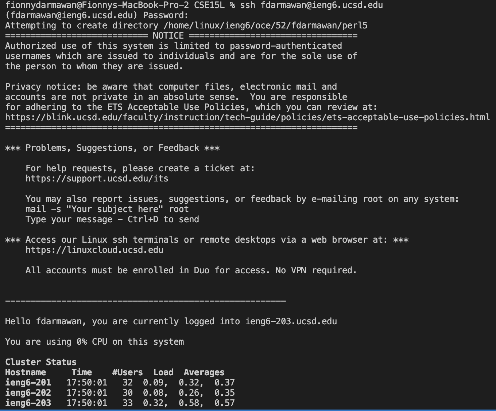
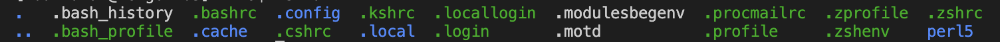

# **Lab Report 1 - Remote Access Tutorial**
## Welcome to CSE 15L! This page will guide you to log into a course-specific account on `ieng6`! 

## Step 1: Installing Visual Studio Code
To download and install VS Code, simnply visit their website [here!](https://code.visualstudio.com/),
and follow through with the instructions of your operating system (macOS or Windows). 

Once you have installed VS Code, make new folder in your computer device. Then on your VSCode, open a new foler. You should be able to open it and view a window that looks like this: 


## Step 2: Connecting to a remote server 
By now, you should have obtained your course-specific account for CSE15L with your new password. 
```
Ex: `cs15lsp23cb@ieng.ucsd.edu` 
```
*If you are on Windows, please follow the instruction [here](https://gitforwindows.org/) to download `git`. Once it is installed, set your default terminal to use the new `git bash` that was just installed by following the instructions [here]( https://stackoverflow.com/questions/42606837/how-do-i-use-bash-on-windows-from-the-visual-studio-code-integrated-terminal/50527994#50527994). 


In your VSCode, open a new Terminal. 


Paste `ssh cs15lsp23zz@ieng6.ucsd.edu` in your command line, replacing `zz` with the two letters assigned in your course-specific account. 

As this would be your first time connecting, you will likely be promptted with a message that ends with 
```
Are you sure you want to continue connecting (yes/no/[fingerprint])?
Password:
```
Type yes on the command line and when it prompts `password:`, type in your new password (the password will not show on screen as you type it). 
Then this should appear on your terminal: 



You are now connected remotely a computer in the CSE basement! This will allow any commands you run on your terminal to be run on the compuetr as well!

**Some errors you might find:**
The screen shot above shows a successful remote connection. However I did not use my course-specific account, but rather my regular student account in order to connect remotely. When I tried using my course-specific account, I kept running into this error message:

We are still not sure why I am getting this error message, but if you happen to come across this error message, ask one of the tutors or even go to one of the TA's office hours. You can also ask a question on StemEd!

## Step 3: Run Some Commands!
This final step is for you try out so commands on the terminal! 
Here are some commands and their expected outputs that you can try: 
`cd`
(This command will produce nothing)

`cd~`
bash: cd~: command not found...

`ls -lat`


`ls -a`


**To log out of the server and terminate the terminal:** 
* Ctrl-D
* Paste the command `exit`


