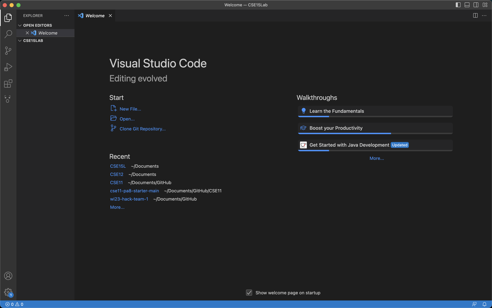

# **Lab Report 1 - Remote Access Tutorial**
## Welcome to CSE 15L! This page will guide you to log into a course-specific account on `ieng6`! 

## Step 1: Installing Visual Studio Code
To download and install VS Code, simnply visit their website [here!](https://code.visualstudio.com/),
and follow through with the instructions of your operating system (macOS or Windows). 

Once you have installed VS Code, make new folder in your computer device. Then on your VSCode, open a new foler. You should be able to open it and view a window that looks like this: 

## Step 2: Connecting to the Server 
By now, you should have obtained your course-specific account for CSE15L. 
Ex: `cs15lsp23cb@ieng.ucsd.edu` 

*If you are on Windows, please follow the instruction [here](https://gitforwindows.org/) to download `git`. Once it is installed, set your default terminal to use the new `git bash` that was just installed by following the instructions [here]( https://stackoverflow.com/questions/42606837/how-do-i-use-bash-on-windows-from-the-visual-studio-code-integrated-terminal/50527994#50527994). 

In your VSCode, open a new Terminal. 

